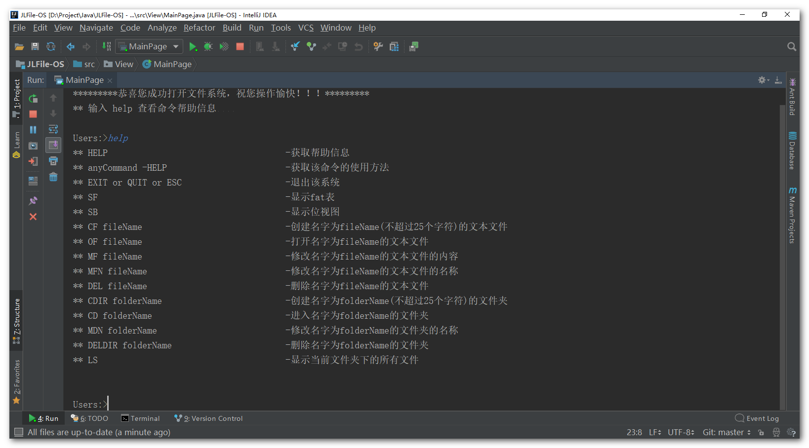
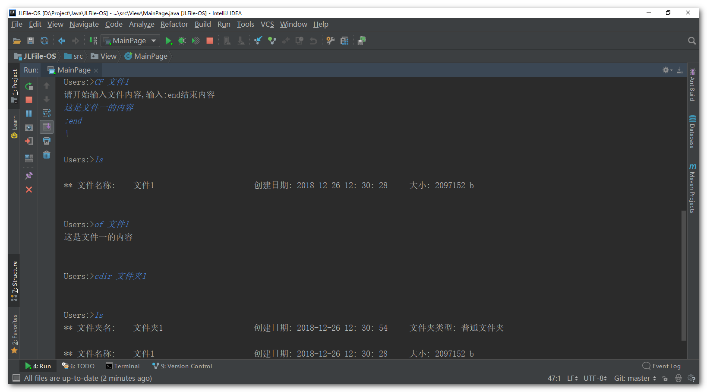

------

   
 

<h1 align="center">JLFile-OS：操作系统课设-模拟文件系统管理

目录：

1. ~~[基础：文件系统的非空闲磁盘块管理](doc/分析准备Pt-1（非空闲磁盘块管理）.md)~~

2. ~~[基础：文件系统的空闲磁盘块管理](doc/分析准备Pt-2（空闲磁盘块管理）.md)~~

3. [基础：文件系统的基础知识](doc/New-分析准备Pt-1（文件系统基础整合）.md)

4. [实现：文件系统的实现思路](doc/New-分析准备Pt-2（文件系统的实现思路）.md)

   注：Pt.1 与 Pt.2 是在研究位示图实验写的，请参考最新的参考资料 Pt.3 与 Pt.4

结果：

- 具体的实现算法选择：
  - FAT : 基于 HashMap 实现
  - 空闲磁盘管理：位示图法，基于二维数组实现
  - 文件的物理结构：显示链接
  - 文件的逻辑结构：流式文件
  - 系统的用户接口：命令行接口
  - FCB 的实现：基于 ArrayList 实现，里面的 FCB 项就是文件
  - 系统的功能：
    - 文件：创建、删除、修改文件名、打开
    - 目录：创建、删除、修改目录名、打开（跳转）

使用：

1. 项目基于 IDEA 普通 Java 项目，使用 Intellij IDEA 2018 打开，找到 View 视图的 MainPage 运行即可
2. 直接 CMD 命令编译 src 目录下的文件

运行示意图：

后言：

> 基础知识整理自 王道考研操作系统-2018

本次课设提前验收，只给了九天左右，还要包括写报告等。实现的功能还差很多，例如用户登录，文件共享功能，序列化的持久存储，都没实现，老师说要验收的时候，只剩五天，而且代码还没写一点，直接想放弃了

在 GitHub 上游走，想着人生中第一次要用别人的课设取验收了么？踌躇了两个多小时后：**" 妈蛋，干特么的！"**

还是打开了 IDEA 重新开始刚课设.....

这个过程，学习基础知识占了五天左右，写代码占了四天，最后实习了一个简单的最基本的文件系统

本次依旧和涛哥合作，涛哥不愧是涛哥，学习速度很快，配合的很好，把视图接口搞定了，可以让我专注于后台底层的开发，还能一起想 Bug

这次一开始用 MVC 架构来写的，但涛哥越写越乱，甚至一开始还有控制器都往一个类写的危险想法，实在不解，但碍于时间，也不想重构它了，所以这里的视图与控制器耦合度极高，都不能说是 MVC 了

验收环节，老师验收看也没看一眼代码，也没看程序，竟然让我们抓阄写题？大学里每一个老师各具特色就是如此

最后，还是成了，还是要感谢涛哥，跟我一起干了一单

**希望对各位有需要的同学有所帮助！**

